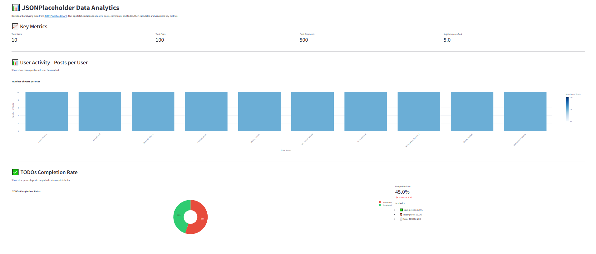
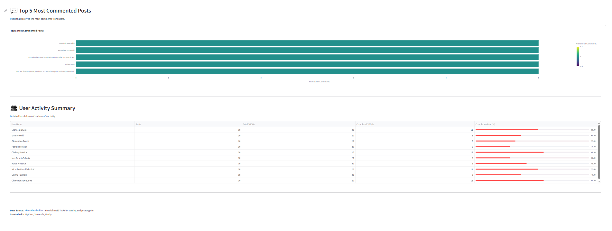

# 📊 JSONPlaceholder Data Analytics

Mini-aplikacja analityczna pobierająca dane z publicznego API [JSONPlaceholder](https://jsonplaceholder.typicode.com), przetważająca je i wizualizująca w formie interaktywnego dashboardu.

## 🎯 Opis projektu

Aplikacja pobiera dane z czterech endpointów API:
- `/users` - informacje o użytkownikach
- `/posts` - posty użytkowników
- `/comments` - komentarze do postów
- `/todos` - zadania do wykonania

Na podstawie pobranych danych obliczane są kluczowe metryki i tworzone wizualizacje, które pomagają zrozumieć aktywność użytkowników w systemie.

## 📈 Metryki i wizualizacje

### Obliczane metryki:
1. **Liczba postów na użytkownika** - pokazuje aktywność każdego użytkownika
2. **Średnia liczba komentarzy na post** - mierzy zaangażowanie w dyskusje
3. **Procent wykonanych TODOs** - wskaźnik produktywności użytkowników
4. **Top 5 najbardziej komentowanych postów** - najpopularniejsze treści

### Wizualizacje:
- 📊 **Wykres słupkowy** - aktywność użytkowników (liczba postów)
- 🍰 **Wykres kołowy** - procent wykonanych vs niewykonanych zadań
- 📉 **Wykres poziomy** - top 5 najbardziej komentowanych postów
- 📋 **Tabela interaktywna** - szczegółowe podsumowanie aktywności użytkowników

## 🖼️ Zrzut ekranu



*Dashboard zawiera metryki kluczowe, interaktywne wykresy i tabelę z danymi użytkowników.*

## 🚀 Jak uruchomić

### Wymagania:
- Python 3.8+
- pip

### Instalacja:

1. Sklonuj repozytorium:
```bash
git clone https://github.com/yourusername/jsonplaceholder-analytics.git
cd jsonplaceholder-analytics
```

2. Zainstaluj zależności:
```bash
pip install -r requirements.txt
```

3. Uruchom aplikację:
```bash
streamlit run app.py
```

4. Otwórz przeglądarkę pod adresem `http://localhost:8501`

## 📁 Struktura projektu

```
jsonplaceholder-analytics/
│
├── app.py                 # Główna aplikacja Streamlit
├── data_fetcher.py        # Moduł pobierania danych z API
├── analytics.py           # Moduł analizy i obliczeń statystyk
├── requirements.txt       # Zależności projektu
├── .gitignore            # Pliki ignorowane przez git
└── README.md             # Dokumentacja projektu
```

## 🛠️ Technologie

- **Python 3.8+** - język programowania
- **Streamlit** - framework do tworzenia aplikacji webowych
- **Plotly** - biblioteka do tworzenia interaktywnych wykresów
- **Pandas** - manipulacja i analiza danych
- **Requests** - komunikacja z API

## 🤖 Wykorzystanie AI (ChatGPT)

Podczas tworzenia projektu używałem ChatGPT/Claude w następujący sposób:

### 1. Planowanie architektury
**Prompt:** *"Jak najlepiej zorganizować kod dla aplikacji Streamlit pobierającej dane z API i pokazującej wykresy?"*

**Pomoc AI:** Zasugerował podział na oddzielne moduły (data fetcher, analytics, app) co poprawiło czytelność i testowalność kodu.

### 2. Implementacja wykresów Plotly
**Prompt:** *"Jak stworzyć wykres kołowy z efektem donut w Plotly z custom kolorami?"*

**Pomoc AI:** Dostarczył przykład użycia `go.Pie` z parametrem `hole=0.4` i `marker_colors`.

### 3. Optymalizacja wydajności
**Prompt:** *"Jak w Streamlit cachować dane z API aby nie pobierać ich przy każdym przeładowaniu?"*

**Pomoc AI:** Wskazał dekorator `@st.cache_data(ttl=3600)` co znacznie przyspieszyło aplikację.

### 4. Obsługa błędów
**Prompt:** *"Jaki jest najlepszy sposób obsługi błędów przy pobieraniu danych z API?"*

**Pomoc AI:** Zasugerował użycie `try-except` z `requests.exceptions.RequestException` oraz informowanie użytkownika o problemach.

### 5. Code review i refactoring
**Prompt:** *"Przejrzyj kod i zasugeruj poprawki zgodne z PEP 8 i best practices"*

**Pomoc AI:** Wskazał miejsca do dodania docstringów, type hints i poprawił nazewnictwo zmiennych.

### Wnioski:
AI było najbardziej pomocne jako:
- 💡 **Generator pomysłów** - na strukturę projektu i organizację kodu
- 📚 **Dokumentacja on-demand** - szybkie odpowiedzi zamiast przeszukiwania docs
- 🔍 **Code reviewer** - wychwycenie potencjalnych problemów
- ⚡ **Przyśpieszenie developmentu** - gotowe snippety do dostosowania

**Nie używałem AI do:** generowania całego projektu na raz - każdy moduł pisałem krok po kroku, rozumiejąc co robi każda linijka.

## 📊 Przykładowe wyniki

Na podstawie danych z JSONPlaceholder:
- **100 postów** od 10 użytkowników (średnio 10 postów/użytkownik)
- **500 komentarzy** (średnio 5 komentarzy/post)
- **200 zadań** z ~50% wskaźnikiem wykonania
- Najbardziej komentowane posty mają 5-7 komentarzy

## 🔗 Linki

- 🌐 **Live Demo:** [Streamlit Cloud](https://your-app.streamlit.app)
- 💻 **Repository:** [GitHub](https://github.com/yourusername/jsonplaceholder-analytics)
- 📖 **API Documentation:** [JSONPlaceholder](https://jsonplaceholder.typicode.com)

## 📝 Licencja

MIT License - projekt stworzony do celów edukacyjnych.

## 👨‍💻 Autor

Projekt stworzony jako zadanie rekrutacyjne dla Cogitech.

---

**Uwaga:** JSONPlaceholder to darmowe fake API służące do testowania i prototypowania. Dane są przykładowe i resetują się przy każdym pobraniu.
